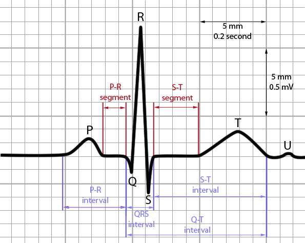

# Library to caluculate LF/HF  
## Discription  
- Calculate LF/HF value  

## Usage  
```
git clone https://github.com/YUTATanamoto/lf-hf.git
cd lf-hf  
pipenv install  
pipenv shell  
jupyter notebook
```

## Fundamentals  
### RRI(RR-Interval), 心拍変動   
- 鼓動の速さを表す指標  
- ある時刻における鼓動と次の鼓動の間の時間を心拍間隔  
- 心拍波形のピーク点R間の間隔を利用  
  

### Refernces  
- [ストレス状態の評価byドコモの人](https://qiita.com/yamamoton/items/633bf830628593e24172)
